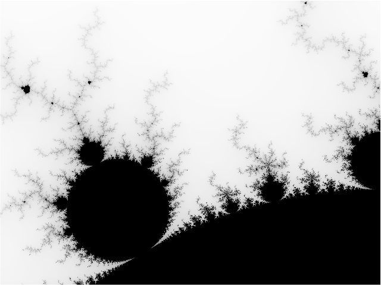

# Mandelbrot in Mojo

This repository contains a [Mojo](https://mojolang.org/) implementation for generating visualizations of the Mandelbrot set. 

The program compiles to a single native executable. It can render the Mandelbrot set directly to the terminal as ASCII art or produce a data file for `gnuplot` to generate a high-resolution PNG image.

### Other Language Implementations

This project is part of a suite of mandelbrot implementations in different languages.

Single Thread/Multi-thread shows the number of seconds it takes to do a 5000x5000 calculation.


| Language    | Repository                                                           | Single Thread   | Multi-Thread | Simd | Multi-Thread + Simd |
| :--------   | :------------------------------------------------------------------- | ---------------:| -----------: | ----:| ------------------: |
| Awk         | [mandelbrot-awk](https://github.com/jesper-olsen/mandelbrot-awk)     |           417.9 |              |      |                     |
| C           | [mandelbrot-c](https://github.com/jesper-olsen/mandelbrot-c)         |             3.6 |          0.6 |  0.7 |               0.2   |
| Erlang      | [mandelbrot_erl](https://github.com/jesper-olsen/mandelbrot_erl)     |            35.6 |          8.3 |      |                     |
| Fortran     | [mandelbrot-f](https://github.com/jesper-olsen/mandelbrot-f)         |             4.5 |              |      |                     |
| Go          | [mandelbrot-go](https://github.com/jesper-olsen/mandelbrot-go)       |             4.1 |          0.8 |  1.3 |               0.4   |
| Java        | [mandelbrot-java](https://github.com/jesper-olsen/mandelbrot-java)   |             3.9 |          0.8 |  1.4 |               0.5   |
| Lua         | [mandelbrot-lua](https://github.com/jesper-olsen/mandelbrot-lua)     |            33.2 |              |      |                     |
| **Mojo**    | [mandelbrot-mojo](https://github.com/jesper-olsen/mandelbrot-mojo)   |             3.8 |          1.2 |  0.7 |               0.4   |
| Nushell     | [mandelbrot-nu](https://github.com/jesper-olsen/mandelbrot-nu)       |         17186.6 |              |      |                     |
| Odin        | [mandelbrot-odin](https://github.com/jesper-olsen/mandelbrot-odin)   |             4.4 |              |
| Python      | [mandelbrot-py](https://github.com/jesper-olsen/mandelbrot-py)       |     (pure) 93.3 | (jax)    5.9 |      |                     |
| R           | [mandelbrot-R](https://github.com/jesper-olsen/mandelbrot-R)         |           335.0 |              |      |                     |
| Rust        | [mandelbrot-rs](https://github.com/jesper-olsen/mandelbrot-rs)       |             4.7 |          1.3 |  1.4 |               0.8   |
| Swift       | [mandelbrot-swift](https://github.com/jesper-olsen/mandelbrot-swift) |             4.5 |          1.2 |  1.3 |               0.7   |
| Tcl         | [mandelbrot-tcl](https://github.com/jesper-olsen/mandelbrot-tcl)     |           306.9 |              |      |                     |
| Zig         | [mandelbrot-zig](https://github.com/jesper-olsen/mandelbrot-zig)     |             4.9 |          0.9 |  0.7 |               0.3   |

---

## Prerequisites

You will need the following installed:

1. [Pixi](https://pixi.sh) - manages the Mojo toolchain (pinned via `pixi.toml`/`pixi.lock` in this repo, Mojo 1.0.0).
2. **Gnuplot** (required *only* for generating PNG images).

---

## Build

```sh
pixi shell
mojo build mandelbrot.mojo
```

---

## Usage

The compiled executable can be configured via command-line arguments using a `key=value` format.

### 1. ASCII Art Output

To render the Mandelbrot set directly in your terminal, run the executable.

```sh
./mandelbrot
```

You can change the view and resolution by passing parameters:
```sh
# Zoom in on a different area with a wider view
./mandelbrot width=120 ll_x=-0.75 ll_y=0.1 ur_x=-0.74 ur_y=0.11
```

### 2. PNG Image Generation

To create a high-resolution PNG, you first generate a data file and then process it with `gnuplot`.

**Step 1: Generate the data file**
Set `png=1` and specify the desired dimensions. Redirect the output to a file.

```sh
./mandelbrot png=1 width=1000 height=750 > image.dat
```

**Step 2: Run gnuplot**
This will read `image.dat` and create `mandelbrot.png`.

```sh
gnuplot topng.gp
```
The result is a high-quality `mandelbrot.png` image.



## Performance

Benchmarks were run on an **Apple M5** system with Mojo 1.0.0b2 (2cf4d08a)

**Generating a 1000x750 data file:**
```sh
time ./mandelbrot png=1 width=1000 height=750 > image.dat
0.15s user 0.01s system 98% cpu 0.160 total
```

**Generating a 5000x5000 data file:**
```sh
time ./mandelbrot png=1 width=5000 height=5000 > image.dat
3.74s user 0.05s system 99% cpu 3.823 total

```

**Generating a 5000x5000 data file with SIMD**
```sh
time ./mandelbrot_simd png=1 width=5000 height=5000 simd=1 parallel=0 > image.dat
0.69s user 0.05s system 99% cpu 0.734 total
```

**Generating a 5000x5000 data file with SIMD + Multi-Thread:**

Note - `parallelize` was in 1.0.0b2 but removed from the stdlib during Mojo 1.0's concurrency
rework (confirmed missing as of 1.0.0 - see forum.modular.com/t/where-did-parallelize-go/3357).

```sh
time ./mandelbrot_simd png=1 width=5000 height=5000 simd=1 parallel=1 > image.dat
0.77s user 0.05s system 216% cpu 0.376 total

```

**Generating a 20000x20000 data file with SIMD + Multi-Thread:**
```sh
time ./mandelbrot_simd png=1 width=20000 height=20000 simd=1 parallel=1 > image.dat
image.da  10.87s user 0.39s system 218% cpu 5.155 total
```


